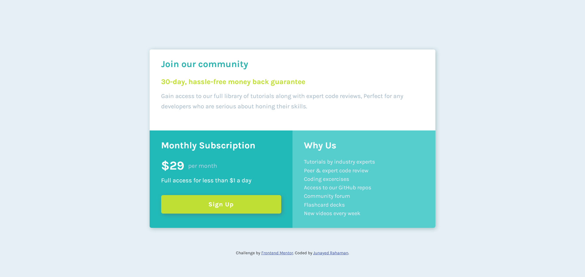

# Frontend Mentor - Single price grid component solution

This is a solution to the [Single price grid component challenge on Frontend Mentor](https://www.frontendmentor.io/challenges/single-price-grid-component-5ce41129d0ff452fec5abbbc). Frontend Mentor challenges help you improve your coding skills by building realistic projects.

## Table of contents

- [The challenge](#the-challenge)
- [Screenshot](#screenshot)
- [Links](#links)
- [My process](#my-process)
- [Built with](#built-with)
- [What I learned](#what-i-learned)
- [Author](#author)

### The challenge

Users should be able to:

- View the optimal layout depending on their device's screen size

### Screenshot

This is the desktop version of the component. I didn't upload the mobile version cause it's too long.

### Links

- Live Site URL: [Live site of the challenge hosted here](https://single-price-grid091.netlify.app/)

## My process

I have built the layout using grid and used flexbox for smaller stuff. The 2 column grid container contains three grid-items with class names item-a, item-b and, item-c with item-a getting full width of the grid container. Made the grid 1 column for devices with width less than 800px.

### Built with

- Semantic HTML5 markup
- CSS custom properties
- Flexbox
- CSS Grid

### What I learned

This project is useful to practice css grid.

## Author

- Website - [Junayed Rahaman](https://webpixels.netlify.app/)
- Frontend Mentor - [@junayedrahaman50](https://www.frontendmentor.io/profile/junayedrahaman50)
- Twitter - [@junayed_rahaman](https://twitter.com/junayed_rahaman)
